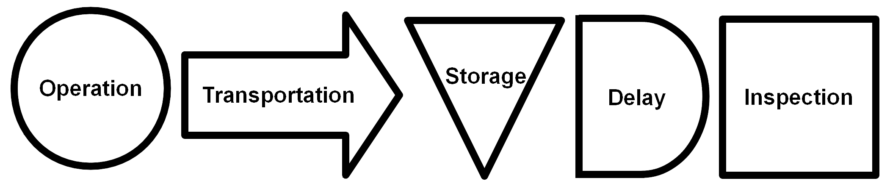

th {
  font-weight: normal;
}

```{r setup, include=FALSE}
knitr::opts_chunk$set(echo = FALSE, 
                      fig.align = 'center', 
                      fig.height = 2)
library(ggplot2)
library(data.table)
library(DiagrammeR)
library(xtable)
library(pander)
theme_set(trstyles::theme_tr())
```

# Systems Definition, Analysis, and Design

## System Analysis and Design Tools

### Cause-Effect Diagram (Fishbone)

<center>
{height="3in"}
</center>

### Pareto Analysis

80% of the items represent 20% of the sales or 20% of the items represent 80% of 
the cost. This law is a rule of thumb.

```{r}
set.seed(42)
items <- paste0("Item ", 1:10)
itemProbs <- c(.6, .2, rep(.025, 8))
nItems <- 10000
itemSamples <- sample(items, nItems, prob = itemProbs, replace = TRUE)
itemTable <- data.table(items = itemSamples)[
  ,.(percent = .N/nItems), by = 'items'][order(percent, decreasing = TRUE)
                                         ][,cumulative := cumsum(percent)][
                                           ,items := factor(items, levels = items)]

ggplot(itemTable) +
  geom_bar(aes(items, percent), stat = 'identity') +
  geom_step(aes(x = as.numeric(items), y = cumulative),
            color = 'red') +
  labs(title = 'Pareto Chart',
       x = "", 
       y = 'Proportion')

```

### Histogram

A bar chart where values are binned into intervals and the count or frequency is
the height of the bars.

```{r}
histData <- rnorm(10000, 100, 10)
qplot(histData, geom = 'histogram', binwidth = 10) +
  labs(title = 'Normal Distribution Sample Data (100, 10)',
       x = 'x')
```

### Scatterplot

A scatterplot is two numeric variables plotted against each other. Often used to 
visually determine if there is correlation.

```{r}

spData <- rnorm(1000, 5, 5)
qplot(spData, spData + rnorm(1000, 0, 3)) +
  labs(title = 'Correlation',
       x = 'x',
       y = 'y')

qplot(spData, rnorm(1000, 5, 5)) +
  labs(title = 'No correlation',
       x = 'x',
       y = 'y')
```

### Operation Process Chart

The operation process chart only has Operations and Inspections.

### Flow Process Chart

The flow process chart forces a more detailed look at a system.

<center>
{height="1.5in"}
</center>

### Affinity Diagram

organizes a large number of ideas into their natural relationships

### Left Hand Right Hand Chart

Shows when each hand is busy and idle. It is sometimes called a simo chart.

## Modeling Techniques

### Queueing Models

**Effective vs. Offered Load:**

$$\lambda_{eff} = \lambda(1-\pi_m)$$

**Waiting Time Law:**

$$L = \sum_{n=0}^Mn\pi_n$$
$$L_q = \sum_{n=c+1}^{c-1}(n-c)\pi_n$$

**Probability of n arivals by time t:**


$$P[N(t)=n]=\frac{(\lambda t)^ne^{-\lambda t}}{n!}$$
<h5>
$M/M/1/\infty\quad Queue$
</h5>
<hr>

**Probability of customers in system:**

$$\pi_0=1-\rho$$
$$\pi_n=\rho^n(1-\rho)$$
$$L = \frac{\rho}{1-\rho}$$
$$L_q = L-\rho=\frac{\rho^2}{1-\rho}$$
<h5>
$M/G/1/\infty\quad Queue$
</h5>
<hr>

**Pollaczek-Khintchine Formula:**

$$L = L_q+\rho=\frac{\rho^2+\lambda^2\sigma^2}{2(1-\rho)}+\rho$$
<h5>
$M/M/c/M\quad Queue$
</h5>
<hr>

$$D = \sum_{n=0}^{c-1}\frac{\rho^n}{n!}+\frac{\rho^c}{c!}[\frac{1-(\rho/c)^{M-c+1}}{1-\rho/c}]$$
$$\pi_0=\frac{1}{D}$$

$$\pi_n= \begin{cases} 
\frac{\rho^n}{n!}\pi_0, \quad \text{n<c} \\
\frac{\rho^n}{c!c^{n-c}}\pi_0, \quad {n\geq c} 
\end{cases}$$


$$L_q=\pi_0\bigg(\frac{\rho^{c+1}}{(c-1)!(c-\rho)^2}\bigg)
\bigg[1-\big(\frac{\rho}{c}\big)^{M-c}-(M-c)\big(\frac{\rho}{c}\big)^{M-c}\big(1-\frac{\rho}{c}\big)\bigg],\quad \rho\neq c$$

$$L_q=\pi_0\bigg(\frac{\rho^c (M-c)(M-c+1)}{2c!}\bigg),\quad \rho=c$$

$$L_q=\pi_0\bigg(\frac{\rho^{c+1}}{(c-1)!(c-\rho)^2}\bigg),\quad c=\infty$$

<h5>
$M/M/1/M\quad Queue$
</h5>
<hr>
**State probability differential equations:**

$$p'_0(t)=\mu_1p_1(t)-\lambda_0p_0(t) \\
p'_k(t)=\lambda_{k-1}p_{k-1}(t)+\mu_{k+1}p_{k+1}(t)-(\lambda_k+\mu_k)p_{k}(t) \quad for \quad k \le K$$

<h5>
$M/M/C/\infty \quad Queue$
</h5>
<hr>

**C = 1**

$$P_0=1-\rho ,\quad L_q=\frac{\rho^2}{1-\rho}$$

**C = 2**

$$P_0=\frac{(1-\rho)}{(1=\rho}, \quad L_q = \frac{2\rho^3}{(1-\rho^2)}$$

**C = 3**

$$P_0 = \frac{2(1-\rho)}{2+4\rho+3\rho^2}, \quad \frac{9\rho^4}{2+2\rho-\rho^2-3\rho^3}$$


### Linear Programming

**Procedure:**

1. Identify the primary decision variables
2. Identify the constraint linear functions
3. Identify the objective linear function

### Model Verification

A model has been verified if a range of models produce similar results on the 
same situation

### Model Validation

A model has been validated if a range of results produce similar results on 
the same situation


### Bottleneck Analysis

Optimize the process that is the bottleneck, then re-evaulate the bottleneck and
repeat.

# Facilities Engineering and Planning

## People/Equipment Requirements

$$M_j = \sum_{i=1}^{n} \frac{P_{ij}T_{ij}}{C_{ij}} \\ M_j = \textrm{number of machines/people} \\ P = \textrm{production rate} \\ T = \textrm{production time} \\ C = \textrm{production period} \\ n = \textrm{number of products}$$

## Material Handling

**Euclidian:**

$$d = \sqrt{(x_2-x_1)^2+(y_2-y_1)^2}$$
$$min\quad \sum_{i=1}^mw_i[(x-a_i)^2+(y-b_i)]^{\frac{1}{2}}$$
If there are 4 locations with equal weight, the optimal location is the facility 
within a triangle of the other facilities. If there is no such facility, 
the optimal location is at the intersection of two lines.

When the weighted costs are proportional to the square of the Euclidean distance, 
it is called the 'gravity' problem.

$$min\quad \sum_{i=1}^mw_i[(x-a_i)^2+(y-b_i)^2]$$

$$x = \frac{\sum_{i=1}^mw_ia_i}{\sum_{i=1}^mw_i}$$
$$y = \frac{\sum_{i=1}^mw_ib_i}{\sum_{i=1}^mw_i}$$

**Manhattan:**

$$|x_2-x_1| + |y_2-y_1|$$

$$min\quad \sum_{i=1}^m w_i(|x-a_1|+|y-b_i|)$$

The x value is the median of the location x-coordinates.
The y value is the median of the location y-coordinates.

**Chebyshev (simultaneous x and y movement)**

$$max(|x_2-x_1|,|y_2-y_1|)$$

## Relationship Chart

```{r relationship chart}
Code <- c('A', 'E', 'I', 'O', 'U', 'X')
Closeness <- c('Absolutely Necessar', 'Especially Important', 'Important',
               'Ordinary Closeness', 'Unimportant', 'Not desirable')
Rank <- c(.95, .85, .7, .5, 0, "-")
relChart <- data.frame(Code, Closeness, Rank,
                       stringsAsFactors = FALSE)
knitr::kable(relChart)
```

# Supply Chain Logistics

## Forecasting Methods

### Moving Average

$$\hat{d}_t = \frac{\sum_{i=1}^{n}d_{t-i}}{n}$$

### Exponentially Weighted Moving Average

$$\hat{d}_t = \alpha d_{t-1}+(1-\alpha)\hat{d}_{t-1},\quad 0 \leq \alpha( \textrm{smoothing constant})\leq1$$

## Production Planning Methods

**Systems to compute Master Production and Ordering Plan**

Material Requirements Planning (MRP)

Manufacturing Resource Planning (MRPII)

## Engineering Economics

$$\bigg(\frac{F}{P}\bigg)= (1+i)^N$$

$$\bigg(\frac{P}{F}\bigg)= \frac{1}{(1+i)^N}$$

$$\bigg(\frac{F}{A}\bigg)= \frac{(1+i)^N-1}{i}$$


$$\bigg(\frac{P}{A}\bigg)= \frac{(1+i)^N-1}{i(1+i)^N}$$

$$\bigg(\frac{A}{F}\bigg)= \frac{i}{(1+i)^N-1}$$

$$\bigg(\frac{A}{P}\bigg)= \frac{i(1+i)^N}{(1+i)^N-1}$$
*Denominator is current value and Numerator is desired conversion

## Production Scheduling Methods

**Makespan**

the time it takes from the start of the first job until the end of the last job

**Scheduling Sequence**

1. Earliest Due Date - order jobs by due date
2. Shortest Processing Time - order jobs by processing time
3. Critical Ratio - divide time remaining until due date by time left on the 
machine, order by smallest critical ratio

**Johnson's Optimal Rule for Two Machines**

1. Find the shortest processsing times and arbitrarily break ties
2. If the shortest processing time is on Machine A, schedule immediately. If the
shortest processing time is on Machine B, schedule it as late as possible.
3. Eliminate the last job scheduled on the list and repeat step 1-2.

## Inventory Management and Control

### Economic Order Quantity

$$Q^*=\sqrt{\frac{2C_pD}{h}R} \\ R = \frac{1}{1-\frac{D}{P}},\quad\textrm{R=1, when replenishment is instaneous} \\ D=\textrm{demand},P=\textrm{production rate},C_p=\textrm{cost per order},h=\textrm{holding cost}$$

### Economic Manufacturing Quantity

Use the equation above with R not equal to 1.

### With shortage costs

$$Q^* = \sqrt{\frac{2C_pD}{h}R\big(\frac{h+z}{z}\big)} \\ z = \textrm{shortage cost}$$

$$M^*=\sqrt{\frac{2C_pD(1-\frac{D}{P})h}{z(h+z)}} \\ M = \textrm{allowed shortage}$$

### Carrying Cost

$$C_T=\frac{hQ}{2}\big(1-\frac{D}{P}\big)+CD+C_p\frac{D}{Q}$$

### Probabilistic Inventory and Production Models

$$F_D(x=y^*)\ge\frac{p-c}{p+h} \\ F_D = \textrm{CDF} \\ x = \textrm{units on hand}, y^*=\textrm{optimal order quantity}, p = \textrm{loss of potential revenue},\\ h = \textrm{loss in value from holding}, c = \textrm{unit acquisition cost}$$

## Distribution Methods

**Transhipment:**

The intermediary storage

### Transportation Problem

$$min \quad \sum_{i=1}^m \sum_{j=1}^nx_{ij}c_{ij} \\ \sum_{j=1}^nx_{ij}=s_i, n = 1, 2, ..., m \\ \sum_{i=1}^mx_{ij}=d_j, m = 1, 2, ..., n$$

### Storage and Warehousing Methods

1. Dedicated Storage
    * easy to retrieve items
    * Sum of maximum of each product
2. Random Storage
    * more efficient use of space
    * Maximum of the sums of all products

    
## Transportation Modes

1. Variable Path
    * truck, vehicle anything that does not have one fixed path
    * versatility
2. Fixed Path
    * conveyor
    * tied to one path
    
## Assignment Problem

**Hungarian Procedure:**

1. Subtract the minimum of the row from all elements in the row
2. Substract the minimum of the column from all elements in the columns
3. Try to make a valid assignment using the zero elements, if all assigments 
cannot be made proceed to next step
4. Cover all zeroes with the minimal number of lines
5. From each uncovered element subtract the minimum of the uncovered *y*, 
add *y* to each intersection element. Go to step 3.
6. Transfer the assignment plan to the original cost table.

# Work Design

## Noise Dose

**Dose**

$$D=100*\big(\frac{C_1}{T_1}+\frac{C_2}{T_2}+...+\frac{C_n}{T_n}\big)\le 100$$

**Time Weighted Average**

$$TWA=16.61log_{10}\big(\frac{D}{100}\big)+90$$

## Exposure

**Time Weighted Concentration**

$$TWA=\frac{\sum_{i=1}^nC_iT_i}{\sum_{i=1}^nT_i}$$


## Taylor Tool Life

$$VT^n=C \\ V = \textrm{speed surface feet per minute} \\ T = \textrm{tool life in minutes} \\ C,n = \textrm{constants that depend on material and tool}$$

## Work Sampling

$$D = Z_{\alpha/2}\sqrt{\frac{p(-1-p)}{n}}, \quad Z_{\alpha/2}\sqrt{\frac{1-p}{pn}} \\ p = \textrm{proportion of observed time} \\ D = \textrm{absolute error} \\ R = \textrm{relative error} = \frac{D}{p} \\ n = \textrm{sample size}$$

## Critical Path Method

$$T = \sum_{(i,j)\in CP}d_{ij}$$

## Standard Time

$$\textrm{Observed Time * Pace Rating * (1 + personal time allowance) * (1 + fatigue allowance)}$$

## Recommended Weight Limit

Units are pounds and inches.

$$RWL = 51(10/H)(1-.0075|V-30|)(.82+\frac{1.8}{D}(1-.0032A)FM*CM \\ \textrm{H = horizontal location of the load forward of the midpoint of the ankles} \\ \textrm{V = vertical location of the load} \\ \textrm{D = Vertical travel distance between the origin and the destination} \\ \textrm{A=angle of asymmetry between hands and feet} \\ \textrm{FM = frequency multiplier (from table)} \\ \textrm{CM = coupling mulitiplier (from table)}$$

## Learning Curve

$$y=kx^n, n=\frac{log_{e}\phi}{log_{e}(2)} \\ \phi=\textrm{learning ratio}=\frac{T(2N)}{T(N)}, \textrm{T(N) = time to produce Nth unit} \\ \textrm{y=total time, k = time to produce first unit, x = number of units produced}$$

**Total Learning Time:**

$$T=k\frac{[(x_2+\frac{1}{2})^{n+1}-(x_1+\frac{1}{2})^{n+1}]}{n+1}$$

**Remission Line:**

$$y=k+\frac{(k-s)(x-1)}{1-x_s}$$

# Quality Control

## Statistical Process Control

### X & R-Chart

$$UCL = D_4\bar{R} \\ CL = \bar{R} \\ LCL = D_3\bar{R}$$

$$UCL = \bar{\bar{X}}+A_2\bar{R} \\ CL = \bar{\bar{X}} \\ LCL = \bar{\bar{X}}-A_2\bar{R}$$

### X & S-Chart

$$UCL=B_4\bar{S} \\ CL = \bar{X} \\ LCL = B_3\bar{S}$$

$$UCL = \bar{\bar{X}} + A_3\bar{S} \\ CL = \bar{\bar{X}} \\ LCL = \bar{\bar{X}}-A_3\bar{S}$$

### P-Chart

$$UCL = \bar{p}+3\sqrt{\frac{\bar{p}(1-\bar{p})}{n}} \\ CL = \bar{p} \\ LCL = \bar{p} - 3\sqrt{\frac{\bar{p}(1-\bar{p})}{n}}$$

### C-Chart

$$UCL = \bar{c}+3\sqrt{\bar{c}} \\ CL = \bar{c} \\ LCL = \bar{c}-3\sqrt{\bar{c}}$$

### Tests for Out of Control

1. A single point falls outside three sigma control limits
2. Two out of three successive points fall on the same side of and more than two 
sigma units from the center line
3. Four out of five successive points fall on the same side of and more than 
one sigma unit from the center line
4. Eight successive points fall on the same side of the center line

## Control vs. Capability

In control if it is within natural variability

Is capable if it is entirely within specification

## Process Capability

**Actual Capability:**

$$C_{pk}=min\bigg(\frac{\mu-LSL}{3\sigma},\frac{USL-\mu}{3\sigma}\bigg)$$

**Potential Capability:**

$$C_p = \frac{USL-LSL}{6\sigma}$$

## Reliability Analysis

**Series:**

$$R = \prod_{i=1}^n P_i$$

**Parallel:**

$$R = 1-\prod_{i=1}^n (1-P_i) $$

# Statistics

## Normal Distribution

**z-score**

$$z=\frac{x-\mu}{\sigma}$$

**Confidence Interval**

$$\bar{x}\pm\frac{z_{\alpha/2} \sigma}{\sqrt{n}}$$

**Two-means comparison:**

$$z_0=\frac{\bar{x}_1-\bar{x}_2}{\sqrt{\frac{\sigma_1^2}{n_1}+\frac{\sigma_2^2}{n_2}}}$$

## student-t Distribution

**t-score:**

$$t=\frac{\bar{x}-\mu}{\frac{s}{\sqrt{n}}}$$

**Confidence Interval**

$$\bar{x}\pm\frac{t_{\alpha/2,n-1}s}{\sqrt{n}}$$

**Two-means comparison:**

$$t_0=\frac{\bar{x}_1-\bar{x}_2}{\sqrt{\frac{s_1^2}{n_1}+\frac{s_2^2}{n_2}}}$$

**df for Two Sample t-test:**

$$df=\frac{\big(\frac{s_1^2}{n_1}+\frac{s_2^2}{n_2}\big)^2}{\frac{(\frac{s_1^2}{n_1})^2}{n_1-1}+{\frac{(\frac{s_1^2}{n_1})^2}{n_1-1}}}$$

## Chi-Squared Goodness of Fit

$$\chi^2=\sum_{j=1}^k\frac{(O_j-E_j)^2}{E_j}$$

## Linear Regression


$$SSR=\sum_{i=1}^n(\hat{y}_i-\bar{y})^2$$

$$SSE = \sum_{i=1}^n(y_i-\hat{y}_i)^2$$

$$SST = \sum_{i=1}^n(y_i-\bar{y})^2$$

$$R^2=\frac{SSR}{SST} = 1-\frac{SSE}{SST}$$

## ANOVA

$$SSA+SSE=SST$$

### ANOVA Table

**One-Way**

Given Treatment A:

$$SSA+SSE=SST$$

```{r oneway ANOVA}
SS <- c('SSA', 'SSE', 'SST')
df <- c('a-1', 'a(n-1)', 'an-1')
MS <- c('SSA/dfA', 'SSE/dfE', '')
fstat <- c('MSA/MSE', '', '')
anovaTable <- data.frame(SS,
                         df,
                         MS,
                         "F" = fstat)
knitr::kable(anovaTable)
```

**Two-Way**

Given treatment factors A & B:

$$SST=SSA+SSB+SSAB+SSE$$

```{r twoway ANOVA}
SS <- c('SSA', 'SSB', 'SSAB', 'SSE', 'SST')
df <- c('a-1', 'b-1', '(a-1)(b-1)', 'ab(n-1)', 'abn-1')
MS <- c('SSA/dfA', 'SSB/dfB', 'SSAB/dfAB', 'SSE/dfE', '')
fstat <- c('MSA/MSE', 'MSB/MSE', 'MSAB/MSE', '', '')
anovaTable <- data.frame(SS,
                         df,
                         MS,
                         "F" = fstat)
knitr::kable(anovaTable)
```

<p style="page-break-before: always">

## Distributions

### Discrete

$$
\begin{array}{|c|c|c|c|}
\hline
\text{Distribution}& \text{pmf} & \text{cdf} & \text{mean} & \text{variance} & \text{parameters} \\
\hline
\text{Binomial} & 
\binom{n}{k}p^k(1-p)^{n-k} & 
\sum_{i=0}^{\lfloor k \rfloor}\binom{n}{i}p^i(1-p)^{n-i} & 
np & 
np(1-p) &
\text{n = number of trials, p = success probability}  \\ \hline
\text{Discrete Uniform} & 
\frac{1}{b-a+1} & 
\frac{\lfloor k \rfloor - a + 1}{b-a+1} & 
\frac{a+b}{2} & 
\frac{(b-a+1)^2-1}{12} & 
\text{a = minimum, b = maximum} \\ \hline
\text{Poisson} & 
\frac{\lambda^k e^{-\lambda}}{k!} & 
e^{-\lambda}\sum_{i=0}^{\lfloor k \rfloor}\frac{\lambda^i}{i!} & 
\lambda & 
\lambda & 
\lambda\text{ = rate} \\ \hline
\text{Geometric} & 
p(1-p)^{k-1} & 
1-(1-p)^k & 
\frac{1}{p} & 
\frac{1-p}{p^2} & 
\text{k = number of trials, p = success probability} \\
\hline
\end{array}
$$

### Continuous

$$
\begin{array}{|c|c|c|c|}
\hline
\text{Distribution}& \text{pdf} & \text{cdf} & \text{mean} & \text{variance} & \text{parameters} \\
\hline
\text{Uniform} & 
\frac{1}{b-a} & 
\frac{x-a}{b-a} & 
\frac{a+b}{2} & 
\frac{(b-a)^2}{12} &
\text{a = minimum, b = maximum} \\ \hline
\text{Exponential} & 
\lambda e^{-\lambda x} & 
1-e^{-\lambda x} & 
\frac{1}{\lambda} & 
\frac{1}{\lambda^2} & 
\lambda \text{ = rate} \\ \hline
\text{Normal} & 
\frac{1}{\sqrt{2\pi \sigma^2}}e^{-\frac{(x-\mu)^2}{2\sigma^2}} & 
\frac{1}{2}\big[1+erf\big(\frac{x-\mu}{\sigma\sqrt{2}}\big)\big] & 
\mu & 
\sigma^2 & 
\mu \text{ = mean, } \sigma^2 \text{ = variance} \\ \hline
\text{PERT beta} & 
undefined & 
undefined & 
\frac{a+4m+b}{6} & 
\frac{(b-a)^2}{36} & 
\text{a = 1st percentile, b = 99th percentile, m = mode} \\ \hline
\text{Triangular} & 
\begin{cases}
\frac{(x-a)^2}{(b-a)(c-a)},\quad a\le x\le c \\
1-\frac{(b-x)^2}{(b-a)(b-c)},\quad c<x\le b
\end{cases} &
\begin{cases}
\frac{(x-a)^2}{(b-a)(c-a)},\quad a\le x\le c \\
1-\frac{(b-x)^2}{(b-a)(b-c)}, \quad c<x\le b
\end{cases} & 
\frac{a+b+c}{3} & 
\frac{a^2+m^2+b^2-ca-ab-cb}{18} & 
\text{a = minimum, b = maximum, c = mode} \\ \hline
\text{Gamma} & 
\frac{\beta^\alpha}{\Gamma(\alpha)}x^{\alpha-1}e^{-\beta x} & 
\frac{1}{\Gamma(\alpha)}\gamma(\alpha,\beta x) & 
\alpha\beta & 
\alpha\beta^2 & 
\alpha \text{ = shape, } \beta \text{ = scale} \\ \hline
\text{Weibull} & 
\frac{k}{\lambda}\binom{x}{\lambda}^{k-1}e^{-{(\frac{x}{\lambda}})^k} &
1-e^{-(\frac{x}{\lambda})^k} & 
 & 
 & 
 \\ \hline
\text{Lognormal} & 
\frac{1}{x\sigma\sqrt{2\pi}}e^{\frac{(ln x-\mu)^2}{2\sigma^2}} & 
\frac{1}{2}+ \frac{1}{2} erf \big[ \frac{ln x-\mu}{\sigma\sqrt{2}}\big]& 
e^{\mu+\frac{\sigma^2}{2}} & 
[e^{\sigma^2}-1] e^{2\mu+\sigma^2} & 
\mu\text{ = mean, } \sigma^2 \text{ = variance} \\
\hline
\end{array}
$$

<p style="page-break-before: always">

## Factors for Control Charts

```{r fcc, echo = FALSE, results='asis'}
ccf <- read.csv('../data/control_chart_factors.csv')
names(ccf) <- sub("([0-9]{1})", "_\\1", names(ccf))
names(ccf)[names(ccf) %in% "invd_2"] <- "d_2^{-1}"
colnames(ccf) <- paste0("$", names(ccf), "$")

ccf <- xtable(ccf,
              caption = "Table 1:",
                      align = rep("c", ncol(ccf)+1),
                      digits = 3)
print(ccf, 
      type = 'html',
      floating = TRUE,
      include.rownames = FALSE,
      caption.placement = "top",
      sanitize.colnames.function = function(x){x},
      html.table.attributes = list("border='1' cellpadding='15' cellpadding='5' rules ='all' width ='100%'"),
      floating.environment = "sidewaystable")
```

<p style="page-break-before: always">

## Normal Distribution

```{r results='asis'}
normalTable <- matrix(round(pnorm(seq(0, 3.09, by = .01)), 4), 
                      ncol = 10,
                      byrow = TRUE)
colnames(normalTable) <- seq(0, .09, by = .01)
rownames(normalTable) <- sprintf("%01.1f", seq(0, 3, by = .1))
z <- row.names(normalTable)
normalTable <- data.frame(z = paste0("**", z, "**"),
                          normalTable,
                          stringsAsFactors = FALSE)
colnames(normalTable) <- c("z", seq(0, .09, by = .01))
normalTable <- xtable(normalTable,
                      caption = "Table 2: Cumulative Probabilities of the Standard Normal Distribution, $X \\sim N(0,1)$",
                      align = rep("c", ncol(normalTable)+1),
                      digits = 4)
print(normalTable, 
      type = 'html',
      floating = TRUE,
      include.rownames = FALSE,
      caption.placement = "top",
      html.table.attributes = list("border='1' cellpadding='15' cellpadding='5' rules ='all' width ='100%'"),
      floating.environment = "sidewaystable")
```

<p style="page-break-before: always">

$$v \bigg \\ \alpha$$

## t-Distribution

```{r results='asis'}
alpha <- c(.1, .05, .025, .01, .005)
v <- c(seq(1, 30, by = 1), Inf)
tTable <- sapply((1-alpha), function(x) qt(x, df = v))
colnames(tTable) <- alpha
tTable <- data.frame( = paste0("**", v, "**"),
                     tTable,
                     stringsAsFactors = FALSE,
                     check.names = FALSE)

tTable <- xtable(tTable,
                      caption = "Table 3:",
                      align = rep("c", ncol(tTable)+1),
                      digits = 4)
print(tTable, 
      type = 'html',
      floating = TRUE,
      include.rownames = FALSE,
      caption.placement = "top",
      sanitize.colnames.function = function(x){x},
      html.table.attributes = list("border='1' cellpadding='15' cellpadding='5' rules ='all' width ='100%'"),
      floating.environment = "sidewaystable")
```

<p style="page-break-before: always">

<h2>
$$\chi^2 \quad Distribution$$
</h2>

```{r chi squared table, results = 'asis', echo=FALSE}
alpha <- c(.995, .99, .975, .95, .9, .75, .5, .25, .1, .05, .025, .01, .005, .001)
v <- seq(1, 100, by = 1)
chiTable <- sapply((1-alpha), function(x) round(qchisq(x, df = v), 2))
colnames(chiTable) <- alpha
rownames(chiTable) <- v
knitr::kable(chiTable, 
             row.names = TRUE,
             align = 'c',
             format = 'latex')
```

**Table X**

$$
\begin{array}{|l|c|c|c|c|c|c|c|c|c|c|c|c|c|c|}
\hline
n \bigg\\ \alpha  & 0.995 & 0.99 & 0.975 & 0.95 & 0.9 & 0.75 & 0.5 & 0.25 & 0.1 & 0.05 & 0.025 & 0.01 & 0.005 & 0.001\\
\hline
1 & 0.00 & 0.00 & 0.00 & 0.00 & 0.02 & 0.10 & 0.45 & 1.32 & 2.71 & 3.84 & 5.02 & 6.63 & 7.88 & 10.83\\
\hline
2 & 0.01 & 0.02 & 0.05 & 0.10 & 0.21 & 0.58 & 1.39 & 2.77 & 4.61 & 5.99 & 7.38 & 9.21 & 10.60 & 13.82\\
\hline
3 & 0.07 & 0.11 & 0.22 & 0.35 & 0.58 & 1.21 & 2.37 & 4.11 & 6.25 & 7.81 & 9.35 & 11.34 & 12.84 & 16.27\\
\hline
4 & 0.21 & 0.30 & 0.48 & 0.71 & 1.06 & 1.92 & 3.36 & 5.39 & 7.78 & 9.49 & 11.14 & 13.28 & 14.86 & 18.47\\
\hline
5 & 0.41 & 0.55 & 0.83 & 1.15 & 1.61 & 2.67 & 4.35 & 6.63 & 9.24 & 11.07 & 12.83 & 15.09 & 16.75 & 20.52\\
\hline
6 & 0.68 & 0.87 & 1.24 & 1.64 & 2.20 & 3.45 & 5.35 & 7.84 & 10.64 & 12.59 & 14.45 & 16.81 & 18.55 & 22.46\\
\hline
7 & 0.99 & 1.24 & 1.69 & 2.17 & 2.83 & 4.25 & 6.35 & 9.04 & 12.02 & 14.07 & 16.01 & 18.48 & 20.28 & 24.32\\
\hline
8 & 1.34 & 1.65 & 2.18 & 2.73 & 3.49 & 5.07 & 7.34 & 10.22 & 13.36 & 15.51 & 17.53 & 20.09 & 21.95 & 26.12\\
\hline
9 & 1.73 & 2.09 & 2.70 & 3.33 & 4.17 & 5.90 & 8.34 & 11.39 & 14.68 & 16.92 & 19.02 & 21.67 & 23.59 & 27.88\\
\hline
10 & 2.16 & 2.56 & 3.25 & 3.94 & 4.87 & 6.74 & 9.34 & 12.55 & 15.99 & 18.31 & 20.48 & 23.21 & 25.19 & 29.59\\
\hline
11 & 2.60 & 3.05 & 3.82 & 4.57 & 5.58 & 7.58 & 10.34 & 13.70 & 17.28 & 19.68 & 21.92 & 24.72 & 26.76 & 31.26\\
\hline
12 & 3.07 & 3.57 & 4.40 & 5.23 & 6.30 & 8.44 & 11.34 & 14.85 & 18.55 & 21.03 & 23.34 & 26.22 & 28.30 & 32.91\\
\hline
13 & 3.57 & 4.11 & 5.01 & 5.89 & 7.04 & 9.30 & 12.34 & 15.98 & 19.81 & 22.36 & 24.74 & 27.69 & 29.82 & 34.53\\
\hline
14 & 4.07 & 4.66 & 5.63 & 6.57 & 7.79 & 10.17 & 13.34 & 17.12 & 21.06 & 23.68 & 26.12 & 29.14 & 31.32 & 36.12\\
\hline
15 & 4.60 & 5.23 & 6.26 & 7.26 & 8.55 & 11.04 & 14.34 & 18.25 & 22.31 & 25.00 & 27.49 & 30.58 & 32.80 & 37.70\\
\hline
16 & 5.14 & 5.81 & 6.91 & 7.96 & 9.31 & 11.91 & 15.34 & 19.37 & 23.54 & 26.30 & 28.85 & 32.00 & 34.27 & 39.25\\
\hline
17 & 5.70 & 6.41 & 7.56 & 8.67 & 10.09 & 12.79 & 16.34 & 20.49 & 24.77 & 27.59 & 30.19 & 33.41 & 35.72 & 40.79\\
\hline
18 & 6.26 & 7.01 & 8.23 & 9.39 & 10.86 & 13.68 & 17.34 & 21.60 & 25.99 & 28.87 & 31.53 & 34.81 & 37.16 & 42.31\\
\hline
19 & 6.84 & 7.63 & 8.91 & 10.12 & 11.65 & 14.56 & 18.34 & 22.72 & 27.20 & 30.14 & 32.85 & 36.19 & 38.58 & 43.82\\
\hline
20 & 7.43 & 8.26 & 9.59 & 10.85 & 12.44 & 15.45 & 19.34 & 23.83 & 28.41 & 31.41 & 34.17 & 37.57 & 40.00 & 45.31\\
\hline
21 & 8.03 & 8.90 & 10.28 & 11.59 & 13.24 & 16.34 & 20.34 & 24.93 & 29.62 & 32.67 & 35.48 & 38.93 & 41.40 & 46.80\\
\hline
22 & 8.64 & 9.54 & 10.98 & 12.34 & 14.04 & 17.24 & 21.34 & 26.04 & 30.81 & 33.92 & 36.78 & 40.29 & 42.80 & 48.27\\
\hline
23 & 9.26 & 10.20 & 11.69 & 13.09 & 14.85 & 18.14 & 22.34 & 27.14 & 32.01 & 35.17 & 38.08 & 41.64 & 44.18 & 49.73\\
\hline
24 & 9.89 & 10.86 & 12.40 & 13.85 & 15.66 & 19.04 & 23.34 & 28.24 & 33.20 & 36.42 & 39.36 & 42.98 & 45.56 & 51.18\\
\hline
25 & 10.52 & 11.52 & 13.12 & 14.61 & 16.47 & 19.94 & 24.34 & 29.34 & 34.38 & 37.65 & 40.65 & 44.31 & 46.93 & 52.62\\
\hline
26 & 11.16 & 12.20 & 13.84 & 15.38 & 17.29 & 20.84 & 25.34 & 30.43 & 35.56 & 38.89 & 41.92 & 45.64 & 48.29 & 54.05\\
\hline
27 & 11.81 & 12.88 & 14.57 & 16.15 & 18.11 & 21.75 & 26.34 & 31.53 & 36.74 & 40.11 & 43.19 & 46.96 & 49.64 & 55.48\\
\hline
28 & 12.46 & 13.56 & 15.31 & 16.93 & 18.94 & 22.66 & 27.34 & 32.62 & 37.92 & 41.34 & 44.46 & 48.28 & 50.99 & 56.89\\
\hline
29 & 13.12 & 14.26 & 16.05 & 17.71 & 19.77 & 23.57 & 28.34 & 33.71 & 39.09 & 42.56 & 45.72 & 49.59 & 52.34 & 58.30\\
\hline
30 & 13.79 & 14.95 & 16.79 & 18.49 & 20.60 & 24.48 & 29.34 & 34.80 & 40.26 & 43.77 & 46.98 & 50.89 & 53.67 & 59.70\\
\hline
31 & 14.46 & 15.66 & 17.54 & 19.28 & 21.43 & 25.39 & 30.34 & 35.89 & 41.42 & 44.99 & 48.23 & 52.19 & 55.00 & 61.10\\
\hline
32 & 15.13 & 16.36 & 18.29 & 20.07 & 22.27 & 26.30 & 31.34 & 36.97 & 42.58 & 46.19 & 49.48 & 53.49 & 56.33 & 62.49\\
\hline
33 & 15.82 & 17.07 & 19.05 & 20.87 & 23.11 & 27.22 & 32.34 & 38.06 & 43.75 & 47.40 & 50.73 & 54.78 & 57.65 & 63.87\\
\hline
34 & 16.50 & 17.79 & 19.81 & 21.66 & 23.95 & 28.14 & 33.34 & 39.14 & 44.90 & 48.60 & 51.97 & 56.06 & 58.96 & 65.25\\
\hline
35 & 17.19 & 18.51 & 20.57 & 22.47 & 24.80 & 29.05 & 34.34 & 40.22 & 46.06 & 49.80 & 53.20 & 57.34 & 60.27 & 66.62\\
\hline
36 & 17.89 & 19.23 & 21.34 & 23.27 & 25.64 & 29.97 & 35.34 & 41.30 & 47.21 & 51.00 & 54.44 & 58.62 & 61.58 & 67.99\\
\hline
37 & 18.59 & 19.96 & 22.11 & 24.07 & 26.49 & 30.89 & 36.34 & 42.38 & 48.36 & 52.19 & 55.67 & 59.89 & 62.88 & 69.35\\
\hline
38 & 19.29 & 20.69 & 22.88 & 24.88 & 27.34 & 31.81 & 37.34 & 43.46 & 49.51 & 53.38 & 56.90 & 61.16 & 64.18 & 70.70\\
\hline
39 & 20.00 & 21.43 & 23.65 & 25.70 & 28.20 & 32.74 & 38.34 & 44.54 & 50.66 & 54.57 & 58.12 & 62.43 & 65.48 & 72.05\\
\hline
40 & 20.71 & 22.16 & 24.43 & 26.51 & 29.05 & 33.66 & 39.34 & 45.62 & 51.81 & 55.76 & 59.34 & 63.69 & 66.77 & 73.40\\
\hline
41 & 21.42 & 22.91 & 25.21 & 27.33 & 29.91 & 34.58 & 40.34 & 46.69 & 52.95 & 56.94 & 60.56 & 64.95 & 68.05 & 74.74\\
\hline
42 & 22.14 & 23.65 & 26.00 & 28.14 & 30.77 & 35.51 & 41.34 & 47.77 & 54.09 & 58.12 & 61.78 & 66.21 & 69.34 & 76.08\\
\hline
43 & 22.86 & 24.40 & 26.79 & 28.96 & 31.63 & 36.44 & 42.34 & 48.84 & 55.23 & 59.30 & 62.99 & 67.46 & 70.62 & 77.42\\
\hline
44 & 23.58 & 25.15 & 27.57 & 29.79 & 32.49 & 37.36 & 43.34 & 49.91 & 56.37 & 60.48 & 64.20 & 68.71 & 71.89 & 78.75\\
\hline
45 & 24.31 & 25.90 & 28.37 & 30.61 & 33.35 & 38.29 & 44.34 & 50.98 & 57.51 & 61.66 & 65.41 & 69.96 & 73.17 & 80.08\\
\hline
46 & 25.04 & 26.66 & 29.16 & 31.44 & 34.22 & 39.22 & 45.34 & 52.06 & 58.64 & 62.83 & 66.62 & 71.20 & 74.44 & 81.40\\
\hline
47 & 25.77 & 27.42 & 29.96 & 32.27 & 35.08 & 40.15 & 46.34 & 53.13 & 59.77 & 64.00 & 67.82 & 72.44 & 75.70 & 82.72\\
\hline
48 & 26.51 & 28.18 & 30.75 & 33.10 & 35.95 & 41.08 & 47.34 & 54.20 & 60.91 & 65.17 & 69.02 & 73.68 & 76.97 & 84.04\\
\hline
49 & 27.25 & 28.94 & 31.55 & 33.93 & 36.82 & 42.01 & 48.33 & 55.27 & 62.04 & 66.34 & 70.22 & 74.92 & 78.23 & 85.35\\
\hline
50 & 27.99 & 29.71 & 32.36 & 34.76 & 37.69 & 42.94 & 49.33 & 56.33 & 63.17 & 67.50 & 71.42 & 76.15 & 79.49 & 86.66\\
\hline
51 & 28.73 & 30.48 & 33.16 & 35.60 & 38.56 & 43.87 & 50.33 & 57.40 & 64.30 & 68.67 & 72.62 & 77.39 & 80.75 & 87.97\\
\hline
52 & 29.48 & 31.25 & 33.97 & 36.44 & 39.43 & 44.81 & 51.33 & 58.47 & 65.42 & 69.83 & 73.81 & 78.62 & 82.00 & 89.27\\
\hline
53 & 30.23 & 32.02 & 34.78 & 37.28 & 40.31 & 45.74 & 52.33 & 59.53 & 66.55 & 70.99 & 75.00 & 79.84 & 83.25 & 90.57\\
\hline
54 & 30.98 & 32.79 & 35.59 & 38.12 & 41.18 & 46.68 & 53.33 & 60.60 & 67.67 & 72.15 & 76.19 & 81.07 & 84.50 & 91.87\\
\hline
55 & 31.73 & 33.57 & 36.40 & 38.96 & 42.06 & 47.61 & 54.33 & 61.66 & 68.80 & 73.31 & 77.38 & 82.29 & 85.75 & 93.17\\
\hline
56 & 32.49 & 34.35 & 37.21 & 39.80 & 42.94 & 48.55 & 55.33 & 62.73 & 69.92 & 74.47 & 78.57 & 83.51 & 86.99 & 94.46\\
\hline
57 & 33.25 & 35.13 & 38.03 & 40.65 & 43.82 & 49.48 & 56.33 & 63.79 & 71.04 & 75.62 & 79.75 & 84.73 & 88.24 & 95.75\\
\hline
58 & 34.01 & 35.91 & 38.84 & 41.49 & 44.70 & 50.42 & 57.33 & 64.86 & 72.16 & 76.78 & 80.94 & 85.95 & 89.48 & 97.04\\
\hline
59 & 34.77 & 36.70 & 39.66 & 42.34 & 45.58 & 51.36 & 58.33 & 65.92 & 73.28 & 77.93 & 82.12 & 87.17 & 90.72 & 98.32\\
\hline
60 & 35.53 & 37.48 & 40.48 & 43.19 & 46.46 & 52.29 & 59.33 & 66.98 & 74.40 & 79.08 & 83.30 & 88.38 & 91.95 & 99.61\\
\hline
61 & 36.30 & 38.27 & 41.30 & 44.04 & 47.34 & 53.23 & 60.33 & 68.04 & 75.51 & 80.23 & 84.48 & 89.59 & 93.19 & 100.89\\
\hline
62 & 37.07 & 39.06 & 42.13 & 44.89 & 48.23 & 54.17 & 61.33 & 69.10 & 76.63 & 81.38 & 85.65 & 90.80 & 94.42 & 102.17\\
\hline
63 & 37.84 & 39.86 & 42.95 & 45.74 & 49.11 & 55.11 & 62.33 & 70.16 & 77.75 & 82.53 & 86.83 & 92.01 & 95.65 & 103.44\\
\hline
64 & 38.61 & 40.65 & 43.78 & 46.59 & 50.00 & 56.05 & 63.33 & 71.23 & 78.86 & 83.68 & 88.00 & 93.22 & 96.88 & 104.72\\
\hline
65 & 39.38 & 41.44 & 44.60 & 47.45 & 50.88 & 56.99 & 64.33 & 72.28 & 79.97 & 84.82 & 89.18 & 94.42 & 98.11 & 105.99\\
\hline
66 & 40.16 & 42.24 & 45.43 & 48.31 & 51.77 & 57.93 & 65.33 & 73.34 & 81.09 & 85.96 & 90.35 & 95.63 & 99.33 & 107.26\\
\hline
67 & 40.94 & 43.04 & 46.26 & 49.16 & 52.66 & 58.87 & 66.33 & 74.40 & 82.20 & 87.11 & 91.52 & 96.83 & 100.55 & 108.53\\
\hline
68 & 41.71 & 43.84 & 47.09 & 50.02 & 53.55 & 59.81 & 67.33 & 75.46 & 83.31 & 88.25 & 92.69 & 98.03 & 101.78 & 109.79\\
\hline
69 & 42.49 & 44.64 & 47.92 & 50.88 & 54.44 & 60.76 & 68.33 & 76.52 & 84.42 & 89.39 & 93.86 & 99.23 & 103.00 & 111.06\\
\hline
70 & 43.28 & 45.44 & 48.76 & 51.74 & 55.33 & 61.70 & 69.33 & 77.58 & 85.53 & 90.53 & 95.02 & 100.43 & 104.21 & 112.32\\
\hline
71 & 44.06 & 46.25 & 49.59 & 52.60 & 56.22 & 62.64 & 70.33 & 78.63 & 86.64 & 91.67 & 96.19 & 101.62 & 105.43 & 113.58\\
\hline
72 & 44.84 & 47.05 & 50.43 & 53.46 & 57.11 & 63.58 & 71.33 & 79.69 & 87.74 & 92.81 & 97.35 & 102.82 & 106.65 & 114.84\\
\hline
73 & 45.63 & 47.86 & 51.26 & 54.33 & 58.01 & 64.53 & 72.33 & 80.75 & 88.85 & 93.95 & 98.52 & 104.01 & 107.86 & 116.09\\
\hline
74 & 46.42 & 48.67 & 52.10 & 55.19 & 58.90 & 65.47 & 73.33 & 81.80 & 89.96 & 95.08 & 99.68 & 105.20 & 109.07 & 117.35\\
\hline
75 & 47.21 & 49.48 & 52.94 & 56.05 & 59.79 & 66.42 & 74.33 & 82.86 & 91.06 & 96.22 & 100.84 & 106.39 & 110.29 & 118.60\\
\hline
76 & 48.00 & 50.29 & 53.78 & 56.92 & 60.69 & 67.36 & 75.33 & 83.91 & 92.17 & 97.35 & 102.00 & 107.58 & 111.50 & 119.85\\
\hline
77 & 48.79 & 51.10 & 54.62 & 57.79 & 61.59 & 68.31 & 76.33 & 84.97 & 93.27 & 98.48 & 103.16 & 108.77 & 112.70 & 121.10\\
\hline
78 & 49.58 & 51.91 & 55.47 & 58.65 & 62.48 & 69.25 & 77.33 & 86.02 & 94.37 & 99.62 & 104.32 & 109.96 & 113.91 & 122.35\\
\hline
79 & 50.38 & 52.72 & 56.31 & 59.52 & 63.38 & 70.20 & 78.33 & 87.08 & 95.48 & 100.75 & 105.47 & 111.14 & 115.12 & 123.59\\
\hline
80 & 51.17 & 53.54 & 57.15 & 60.39 & 64.28 & 71.14 & 79.33 & 88.13 & 96.58 & 101.88 & 106.63 & 112.33 & 116.32 & 124.84\\
\hline
81 & 51.97 & 54.36 & 58.00 & 61.26 & 65.18 & 72.09 & 80.33 & 89.18 & 97.68 & 103.01 & 107.78 & 113.51 & 117.52 & 126.08\\
\hline
82 & 52.77 & 55.17 & 58.84 & 62.13 & 66.08 & 73.04 & 81.33 & 90.24 & 98.78 & 104.14 & 108.94 & 114.69 & 118.73 & 127.32\\
\hline
83 & 53.57 & 55.99 & 59.69 & 63.00 & 66.98 & 73.99 & 82.33 & 91.29 & 99.88 & 105.27 & 110.09 & 115.88 & 119.93 & 128.56\\
\hline
84 & 54.37 & 56.81 & 60.54 & 63.88 & 67.88 & 74.93 & 83.33 & 92.34 & 100.98 & 106.39 & 111.24 & 117.06 & 121.13 & 129.80\\
\hline
85 & 55.17 & 57.63 & 61.39 & 64.75 & 68.78 & 75.88 & 84.33 & 93.39 & 102.08 & 107.52 & 112.39 & 118.24 & 122.32 & 131.04\\
\hline
86 & 55.97 & 58.46 & 62.24 & 65.62 & 69.68 & 76.83 & 85.33 & 94.45 & 103.18 & 108.65 & 113.54 & 119.41 & 123.52 & 132.28\\
\hline
87 & 56.78 & 59.28 & 63.09 & 66.50 & 70.58 & 77.78 & 86.33 & 95.50 & 104.28 & 109.77 & 114.69 & 120.59 & 124.72 & 133.51\\
\hline
88 & 57.58 & 60.10 & 63.94 & 67.37 & 71.48 & 78.73 & 87.33 & 96.55 & 105.37 & 110.90 & 115.84 & 121.77 & 125.91 & 134.75\\
\hline
89 & 58.39 & 60.93 & 64.79 & 68.25 & 72.39 & 79.68 & 88.33 & 97.60 & 106.47 & 112.02 & 116.99 & 122.94 & 127.11 & 135.98\\
\hline
90 & 59.20 & 61.75 & 65.65 & 69.13 & 73.29 & 80.62 & 89.33 & 98.65 & 107.57 & 113.15 & 118.14 & 124.12 & 128.30 & 137.21\\
\hline
91 & 60.00 & 62.58 & 66.50 & 70.00 & 74.20 & 81.57 & 90.33 & 99.70 & 108.66 & 114.27 & 119.28 & 125.29 & 129.49 & 138.44\\
\hline
92 & 60.81 & 63.41 & 67.36 & 70.88 & 75.10 & 82.52 & 91.33 & 100.75 & 109.76 & 115.39 & 120.43 & 126.46 & 130.68 & 139.67\\
\hline
93 & 61.63 & 64.24 & 68.21 & 71.76 & 76.01 & 83.47 & 92.33 & 101.80 & 110.85 & 116.51 & 121.57 & 127.63 & 131.87 & 140.89\\
\hline
94 & 62.44 & 65.07 & 69.07 & 72.64 & 76.91 & 84.42 & 93.33 & 102.85 & 111.94 & 117.63 & 122.72 & 128.80 & 133.06 & 142.12\\
\hline
95 & 63.25 & 65.90 & 69.92 & 73.52 & 77.82 & 85.38 & 94.33 & 103.90 & 113.04 & 118.75 & 123.86 & 129.97 & 134.25 & 143.34\\
\hline
96 & 64.06 & 66.73 & 70.78 & 74.40 & 78.73 & 86.33 & 95.33 & 104.95 & 114.13 & 119.87 & 125.00 & 131.14 & 135.43 & 144.57\\
\hline
97 & 64.88 & 67.56 & 71.64 & 75.28 & 79.63 & 87.28 & 96.33 & 106.00 & 115.22 & 120.99 & 126.14 & 132.31 & 136.62 & 145.79\\
\hline
98 & 65.69 & 68.40 & 72.50 & 76.16 & 80.54 & 88.23 & 97.33 & 107.05 & 116.32 & 122.11 & 127.28 & 133.48 & 137.80 & 147.01\\
\hline
99 & 66.51 & 69.23 & 73.36 & 77.05 & 81.45 & 89.18 & 98.33 & 108.09 & 117.41 & 123.23 & 128.42 & 134.64 & 138.99 & 148.23\\
\hline
100 & 67.33 & 70.06 & 74.22 & 77.93 & 82.36 & 90.13 & 99.33 & 109.14 & 118.50 & 124.34 & 129.56 & 135.81 & 140.17 & 149.45\\
\hline
\end{array}
$$

<p style="page-break-before: always">

<h2>
$$
F(v_1, v_2) \text{ Distribution}
$$
</h2>


```{r 95th F Dist, results = 'asis', echo = FALSE}
v1 <- c(seq(1, 10, by = 1), 12, 15, 20, 24, 30, 40, 60, 120, Inf)
v2 <- v1
fTable95 <- sapply(v1, function(x) signif(qf(.95, x, v2), 3))
colnames(fTable95) <- v1
rownames(fTable95) <- v2
knitr::kable(fTable95, 
             row.names = TRUE,
             format = 'latex',
             align = 'c')
```

**Table X**

$$
\begin{array}{|l|c|c|c|c|c|c|c|c|c|c|c|c|c|c|c|c|c|c|c|}
\hline
v_2 \bigg\\ v_1  & 1 & 2 & 3 & 4 & 5 & 6 & 7 & 8 & 9 & 10 & 12 & 15 & 20 & 24 & 30 & 40 & 60 & 120 & Inf\\
\hline
1 & 161.00 & 199.00 & 216.00 & 225.00 & 230.00 & 234.00 & 237.00 & 239.00 & 241.00 & 242.00 & 244.00 & 246.00 & 248.00 & 249.00 & 250.00 & 251.00 & 252.00 & 253.00 & 254.00\\
\hline
2 & 18.50 & 19.00 & 19.20 & 19.20 & 19.30 & 19.30 & 19.40 & 19.40 & 19.40 & 19.40 & 19.40 & 19.40 & 19.40 & 19.50 & 19.50 & 19.50 & 19.50 & 19.50 & 19.50\\
\hline
3 & 10.10 & 9.55 & 9.28 & 9.12 & 9.01 & 8.94 & 8.89 & 8.85 & 8.81 & 8.79 & 8.74 & 8.70 & 8.66 & 8.64 & 8.62 & 8.59 & 8.57 & 8.55 & 8.53\\
\hline
4 & 7.71 & 6.94 & 6.59 & 6.39 & 6.26 & 6.16 & 6.09 & 6.04 & 6.00 & 5.96 & 5.91 & 5.86 & 5.80 & 5.77 & 5.75 & 5.72 & 5.69 & 5.66 & 5.63\\
\hline
5 & 6.61 & 5.79 & 5.41 & 5.19 & 5.05 & 4.95 & 4.88 & 4.82 & 4.77 & 4.74 & 4.68 & 4.62 & 4.56 & 4.53 & 4.50 & 4.46 & 4.43 & 4.40 & 4.36\\
\hline
6 & 5.99 & 5.14 & 4.76 & 4.53 & 4.39 & 4.28 & 4.21 & 4.15 & 4.10 & 4.06 & 4.00 & 3.94 & 3.87 & 3.84 & 3.81 & 3.77 & 3.74 & 3.70 & 3.67\\
\hline
7 & 5.59 & 4.74 & 4.35 & 4.12 & 3.97 & 3.87 & 3.79 & 3.73 & 3.68 & 3.64 & 3.57 & 3.51 & 3.44 & 3.41 & 3.38 & 3.34 & 3.30 & 3.27 & 3.23\\
\hline
8 & 5.32 & 4.46 & 4.07 & 3.84 & 3.69 & 3.58 & 3.50 & 3.44 & 3.39 & 3.35 & 3.28 & 3.22 & 3.15 & 3.12 & 3.08 & 3.04 & 3.01 & 2.97 & 2.93\\
\hline
9 & 5.12 & 4.26 & 3.86 & 3.63 & 3.48 & 3.37 & 3.29 & 3.23 & 3.18 & 3.14 & 3.07 & 3.01 & 2.94 & 2.90 & 2.86 & 2.83 & 2.79 & 2.75 & 2.71\\
\hline
10 & 4.96 & 4.10 & 3.71 & 3.48 & 3.33 & 3.22 & 3.14 & 3.07 & 3.02 & 2.98 & 2.91 & 2.85 & 2.77 & 2.74 & 2.70 & 2.66 & 2.62 & 2.58 & 2.54\\
\hline
12 & 4.75 & 3.89 & 3.49 & 3.26 & 3.11 & 3.00 & 2.91 & 2.85 & 2.80 & 2.75 & 2.69 & 2.62 & 2.54 & 2.51 & 2.47 & 2.43 & 2.38 & 2.34 & 2.30\\
\hline
15 & 4.54 & 3.68 & 3.29 & 3.06 & 2.90 & 2.79 & 2.71 & 2.64 & 2.59 & 2.54 & 2.48 & 2.40 & 2.33 & 2.29 & 2.25 & 2.20 & 2.16 & 2.11 & 2.07\\
\hline
20 & 4.35 & 3.49 & 3.10 & 2.87 & 2.71 & 2.60 & 2.51 & 2.45 & 2.39 & 2.35 & 2.28 & 2.20 & 2.12 & 2.08 & 2.04 & 1.99 & 1.95 & 1.90 & 1.84\\
\hline
24 & 4.26 & 3.40 & 3.01 & 2.78 & 2.62 & 2.51 & 2.42 & 2.36 & 2.30 & 2.25 & 2.18 & 2.11 & 2.03 & 1.98 & 1.94 & 1.89 & 1.84 & 1.79 & 1.73\\
\hline
30 & 4.17 & 3.32 & 2.92 & 2.69 & 2.53 & 2.42 & 2.33 & 2.27 & 2.21 & 2.16 & 2.09 & 2.01 & 1.93 & 1.89 & 1.84 & 1.79 & 1.74 & 1.68 & 1.62\\
\hline
40 & 4.08 & 3.23 & 2.84 & 2.61 & 2.45 & 2.34 & 2.25 & 2.18 & 2.12 & 2.08 & 2.00 & 1.92 & 1.84 & 1.79 & 1.74 & 1.69 & 1.64 & 1.58 & 1.51\\
\hline
60 & 4.00 & 3.15 & 2.76 & 2.53 & 2.37 & 2.25 & 2.17 & 2.10 & 2.04 & 1.99 & 1.92 & 1.84 & 1.75 & 1.70 & 1.65 & 1.59 & 1.53 & 1.47 & 1.39\\
\hline
120 & 3.92 & 3.07 & 2.68 & 2.45 & 2.29 & 2.18 & 2.09 & 2.02 & 1.96 & 1.91 & 1.83 & 1.75 & 1.66 & 1.61 & 1.55 & 1.50 & 1.43 & 1.35 & 1.25\\
\hline
Inf & 3.84 & 3.00 & 2.60 & 2.37 & 2.21 & 2.10 & 2.01 & 1.94 & 1.88 & 1.83 & 1.75 & 1.67 & 1.57 & 1.52 & 1.46 & 1.39 & 1.32 & 1.22 & 1.00\\
\hline
\end{array}
$$

```{r 99th F Distribution, results='asis', echo=FALSE}
v1 <- c(seq(1, 10, by = 1), 12, 15, 20, 24, 30, 40, 60, 120, Inf)
v2 <- v1
fTable99 <- sapply(v1, function(x) signif(qf(.99, x, v2), 3))
colnames(fTable99) <- v1
rownames(fTable99) <- v2
knitr::kable(fTable99, 
             row.names = TRUE, 
             format = 'latex', 
             align = 'c')
```

<p style="page-break-before: always">

**Table X**

$$
\begin{array}{|l|c|c|c|c|c|c|c|c|c|c|c|c|c|c|c|c|c|c|c|}
\hline
v_2 \bigg\\ v_1 & 1 & 2 & 3 & 4 & 5 & 6 & 7 & 8 & 9 & 10 & 12 & 15 & 20 & 24 & 30 & 40 & 60 & 120 & Inf\\
\hline
1 & 4050.00 & 5000.00 & 5400.00 & 5620.00 & 5760.00 & 5860.00 & 5930.00 & 5980.00 & 6020.00 & 6060.00 & 6110.00 & 6160.00 & 6210.00 & 6230.00 & 6260.00 & 6290.00 & 6310.00 & 6340.00 & 6370.00\\
\hline
2 & 98.50 & 99.00 & 99.20 & 99.20 & 99.30 & 99.30 & 99.40 & 99.40 & 99.40 & 99.40 & 99.40 & 99.40 & 99.40 & 99.50 & 99.50 & 99.50 & 99.50 & 99.50 & 99.50\\
\hline
3 & 34.10 & 30.80 & 29.50 & 28.70 & 28.20 & 27.90 & 27.70 & 27.50 & 27.30 & 27.20 & 27.10 & 26.90 & 26.70 & 26.60 & 26.50 & 26.40 & 26.30 & 26.20 & 26.10\\
\hline
4 & 21.20 & 18.00 & 16.70 & 16.00 & 15.50 & 15.20 & 15.00 & 14.80 & 14.70 & 14.50 & 14.40 & 14.20 & 14.00 & 13.90 & 13.80 & 13.70 & 13.70 & 13.60 & 13.50\\
\hline
5 & 16.30 & 13.30 & 12.10 & 11.40 & 11.00 & 10.70 & 10.50 & 10.30 & 10.20 & 10.10 & 9.89 & 9.72 & 9.55 & 9.47 & 9.38 & 9.29 & 9.20 & 9.11 & 9.02\\
\hline
6 & 13.70 & 10.90 & 9.78 & 9.15 & 8.75 & 8.47 & 8.26 & 8.10 & 7.98 & 7.87 & 7.72 & 7.56 & 7.40 & 7.31 & 7.23 & 7.14 & 7.06 & 6.97 & 6.88\\
\hline
7 & 12.20 & 9.55 & 8.45 & 7.85 & 7.46 & 7.19 & 6.99 & 6.84 & 6.72 & 6.62 & 6.47 & 6.31 & 6.16 & 6.07 & 5.99 & 5.91 & 5.82 & 5.74 & 5.65\\
\hline
8 & 11.30 & 8.65 & 7.59 & 7.01 & 6.63 & 6.37 & 6.18 & 6.03 & 5.91 & 5.81 & 5.67 & 5.52 & 5.36 & 5.28 & 5.20 & 5.12 & 5.03 & 4.95 & 4.86\\
\hline
9 & 10.60 & 8.02 & 6.99 & 6.42 & 6.06 & 5.80 & 5.61 & 5.47 & 5.35 & 5.26 & 5.11 & 4.96 & 4.81 & 4.73 & 4.65 & 4.57 & 4.48 & 4.40 & 4.31\\
\hline
10 & 10.00 & 7.56 & 6.55 & 5.99 & 5.64 & 5.39 & 5.20 & 5.06 & 4.94 & 4.85 & 4.71 & 4.56 & 4.41 & 4.33 & 4.25 & 4.17 & 4.08 & 4.00 & 3.91\\
\hline
12 & 9.33 & 6.93 & 5.95 & 5.41 & 5.06 & 4.82 & 4.64 & 4.50 & 4.39 & 4.30 & 4.16 & 4.01 & 3.86 & 3.78 & 3.70 & 3.62 & 3.54 & 3.45 & 3.36\\
\hline
15 & 8.68 & 6.36 & 5.42 & 4.89 & 4.56 & 4.32 & 4.14 & 4.00 & 3.89 & 3.80 & 3.67 & 3.52 & 3.37 & 3.29 & 3.21 & 3.13 & 3.05 & 2.96 & 2.87\\
\hline
20 & 8.10 & 5.85 & 4.94 & 4.43 & 4.10 & 3.87 & 3.70 & 3.56 & 3.46 & 3.37 & 3.23 & 3.09 & 2.94 & 2.86 & 2.78 & 2.69 & 2.61 & 2.52 & 2.42\\
\hline
24 & 7.82 & 5.61 & 4.72 & 4.22 & 3.90 & 3.67 & 3.50 & 3.36 & 3.26 & 3.17 & 3.03 & 2.89 & 2.74 & 2.66 & 2.58 & 2.49 & 2.40 & 2.31 & 2.21\\
\hline
30 & 7.56 & 5.39 & 4.51 & 4.02 & 3.70 & 3.47 & 3.30 & 3.17 & 3.07 & 2.98 & 2.84 & 2.70 & 2.55 & 2.47 & 2.39 & 2.30 & 2.21 & 2.11 & 2.01\\
\hline
40 & 7.31 & 5.18 & 4.31 & 3.83 & 3.51 & 3.29 & 3.12 & 2.99 & 2.89 & 2.80 & 2.66 & 2.52 & 2.37 & 2.29 & 2.20 & 2.11 & 2.02 & 1.92 & 1.80\\
\hline
60 & 7.08 & 4.98 & 4.13 & 3.65 & 3.34 & 3.12 & 2.95 & 2.82 & 2.72 & 2.63 & 2.50 & 2.35 & 2.20 & 2.12 & 2.03 & 1.94 & 1.84 & 1.73 & 1.60\\
\hline
120 & 6.85 & 4.79 & 3.95 & 3.48 & 3.17 & 2.96 & 2.79 & 2.66 & 2.56 & 2.47 & 2.34 & 2.19 & 2.03 & 1.95 & 1.86 & 1.76 & 1.66 & 1.53 & 1.38\\
\hline
Inf & 6.63 & 4.61 & 3.78 & 3.32 & 3.02 & 2.80 & 2.64 & 2.51 & 2.41 & 2.32 & 2.18 & 2.04 & 1.88 & 1.79 & 1.70 & 1.59 & 1.47 & 1.32 & 1.00\\
\hline
\end{array}
$$
